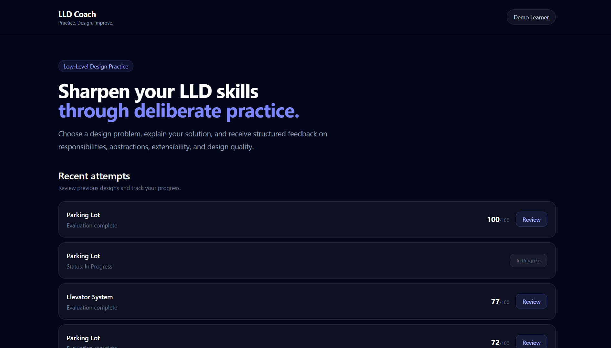
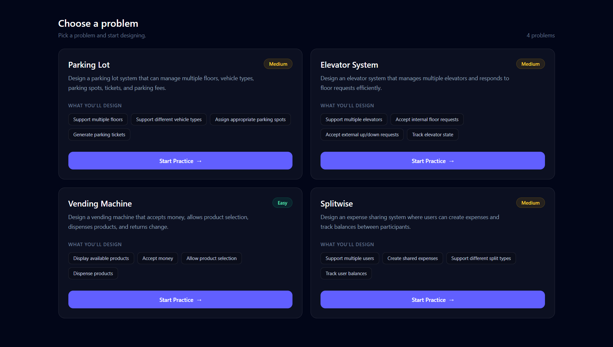
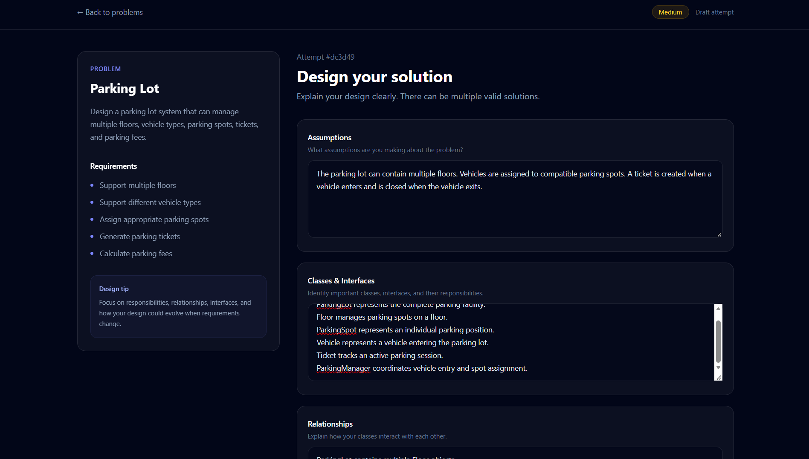
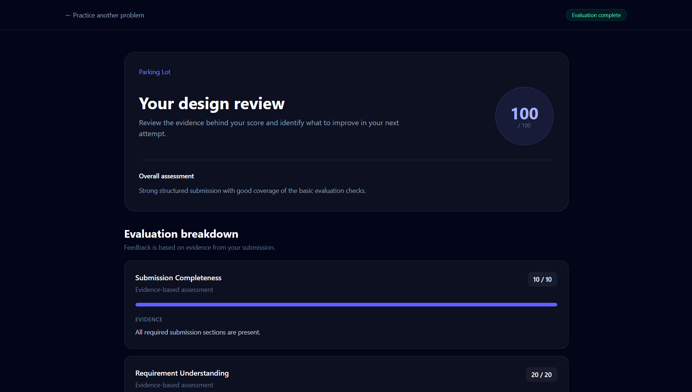
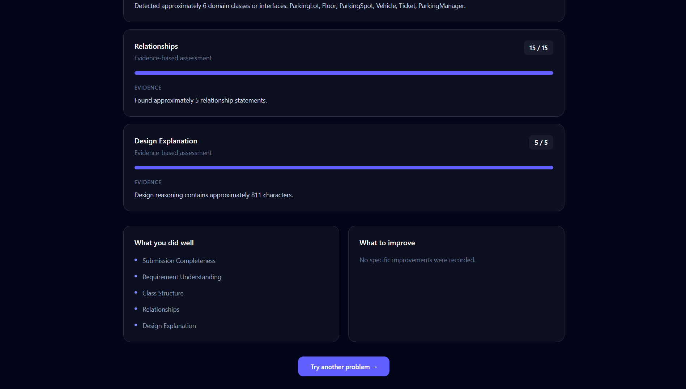
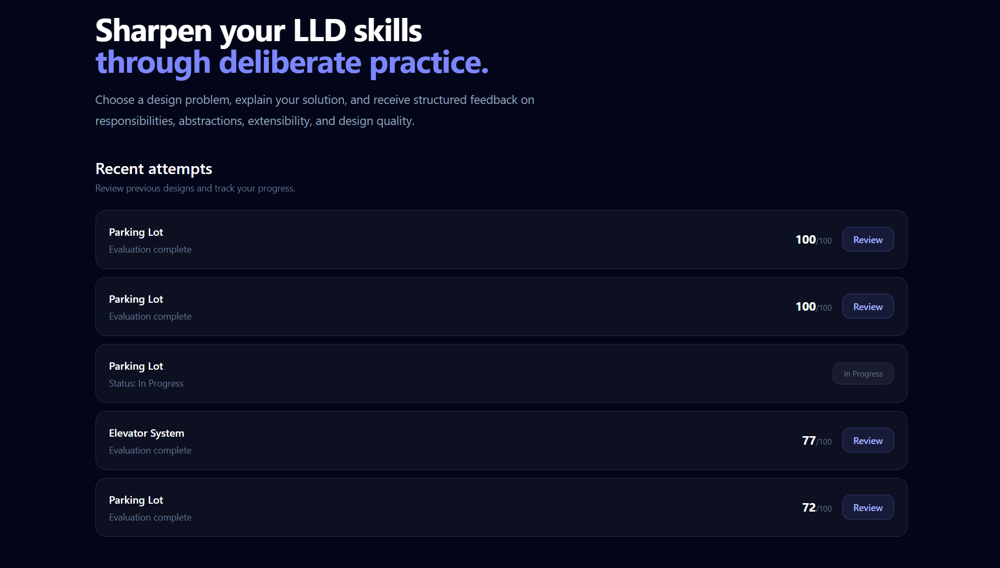

# LLD Coach

LLD Coach is a lightweight Low-Level Design practice platform that helps learners solve LLD problems, submit their designs, receive structured feedback, review previous attempts, and try again.

The core learner journey is:

> Choose Problem → Think / Design → Submit → Get Feedback → Review → Try Again

## Features

- LLD problem catalogue
- Attempt-based practice workflow
- Structured design submission
- Assumptions, classes, relationships, and design reasoning
- Deterministic rule-based evaluation
- AI evaluation abstraction
- Hybrid AI + rule-based fallback
- Rubric-based scoring
- Evidence-based feedback
- Actionable improvement suggestions
- Attempt history
- Review previous submissions
- Retry previous problems
- Backend unit tests

---

## Tech Stack

### Frontend

- React
- TypeScript
- Vite

### Backend

- Node.js
- Express
- TypeScript

### Database

- MongoDB
- Mongoose

### Architecture

- Modular monolith
- Domain-oriented design
- Service layer
- Repository pattern
- Strategy-based evaluator abstraction

---

## Product Walkthrough

LLD Coach is designed around a simple iterative learning workflow:

**Choose Problem → Design → Submit → Get Feedback → Review → Try Again**

### Dashboard

The dashboard provides a focused entry point for LLD practice and shows the learner's recent attempts and progress.



### 1. Choose a Problem

Learners can choose from LLD problems with difficulty levels and clearly defined requirements.



### 2. Design & Submit

Each problem provides the requirements alongside structured sections for the learner to explain their assumptions, classes/interfaces, relationships, and design reasoning.



### 3. Evaluation & Feedback

After submission, the learner receives structured feedback based on the evaluation rubric, including evidence and scores for individual criteria.





### 4. Review & History

Previous attempts are preserved so learners can review their feedback and compare their progress across attempts.



## Architecture

```text
                    React Frontend
                          |
                          v
                    Express API
                          |
                          v
                     Controllers
                          |
                          v
                       Services
                          |
             +------------+------------+
             |                         |
             v                         v
        Repositories                Evaluator
             |                         |
             v                 +-------+-------+
          MongoDB              |       |       |
                               v       v       v
                           RuleBased   AI    Hybrid
                                      |        |
                                      v        |
                                  AIClient     |
                                      |        |
                                      v        |
                                  MockAIClient+